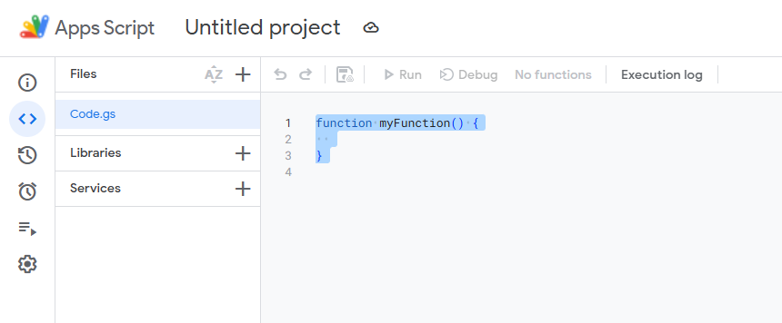

# Automate cataloguing of receipts for a financial report
## Why?
If you make financial reports you know how much time-consuming it is to retrieve all the related files and put them in order. If you make financial reports you are also keeping track of all the expenditures of one or more projects in a spreadsheet like a ledger book. This script can read your spreadsheet and organize all the files by progressive number and budget line.
## Requirements
1. Your spreadsheet must be in Google Sheet format and hosted in your Drive. You can convert an .xlsx file in google sheet format, check this screenshot:


2. You must dedicate only one row for each expenditure.
3. Your spreadsheet must have
   - one column dedicated to progressive numbers of the receipts
   - one column dedicated to budget lines
   - one column dedicated to URLs. Check the Ledger Book in the Test folder to have an example.
4. The files that you need for the financial report must be hosted in Google Drive and must be accessible for your Google account. To link a file or a folder, when you are in Drive you can right-click on them and select `Share > Copy link`


## How it works?
This script analyses each row of your spreadsheet (you can set a specific starting row in the code), takes every file you linked in the URL column and copies it in a specific folder which will host your financial report. Each file will be copied inside a folder which name is the progressive number you assigned to that file, which will be created inside a folder with the related budget line code. In this way the financial auditor will find a report perfectly ordered by budget line, and inside each budget line folder will find the folders named with the progressive number of each expenditure, and inside each folder he will find the related file. In this way if he wants to search for a specific expenditure he only has to search for the progressive number, and he will find the related folder. 

Assuming that the folder you created for the financial report is called "Financial report", the path for each file you linked will be:
```
Financial report/
├── Budget line 1/
|    ├── 001
|        └── file001.pdf (the title of the files will not change)
|    └── 002
|        └── file002.pdf
└── Budget line 2/
    ├── 003
        └── file003.pdf
    ├── ...
```


If you have a complex purchase procedure (e.g. a tender) you will have more files for one single expenditure. In this case you can link a whole folder in your spreadsheet, and even folders inside a folder. The path will be the following:

```
Financial report/
└── Budget line 1/
    ├── 001
        ├── file001_1.pdf 
        ├── file001_2.pdf
        ├── ...
        └── Subfolder/
            └── file001_X.pdf
```
This script skips every file that is not a .pdf, so that you can keep other useful files in the original folders that you don't want to show to the auditor.

If your source folder contains:
```
Folder1/
├── document.pdf (copied)
├── image.jpg (skipped)
└── Subfolder/
    ├── order_form.pdf (copied)
    └── order_form.xlsx (skipped)
```	
The target will contain:
```
Folder1/
├── document.pdf
└── Subfolder/
    └── order_form.pdf
```
If you have expenditures that have not been assigned to any budget line (e.g. transfers from a bank account to another) those files will be copied in a folder called `No budget line`.

Everything is automatic. All you have to do is to keep a nicely ordered ledger book and be sure to have linked there every file you need in the financial report.
## How to use it
Open your spreadsheet, go to `Extensions > Apps Script`


Select the code you see (you can use `CTRL + A`)



Paste the content of the file `financial-report.ts` you find above (if you click on it, you will open it and you can copy the content), then configure this section (the text after `//` explains them. You only have to paste the link and change the number if needed)


Click on `Save project to Drive`


Click on `runThis`


Then on `Run the selected function`


Click on Review permissions and then login with your Google account


Click on Advanced (The script is safe. Google gives you this alert because I didn't verify this script. I have no idea how to do it and I don't want to lose time in it. If someone know how to do this can contact me on Telegram at @mortacci)


Click on Go to `Untitled project (unsafe)`


Click on `Select all` and then on `Continue`


The script will start doing its job. It can take several minutes. You can read what it's doing in the Execution log


Wait until the process is complete. A message saying `Financial report is now ready!` will show up in the window below.


Now the script will remain permanently connected to your spreadsheet. This means that the next time you'll need this you only have to go to `Extensions > Apps Script`, click on `runThis` and then `Run the selected function`.
